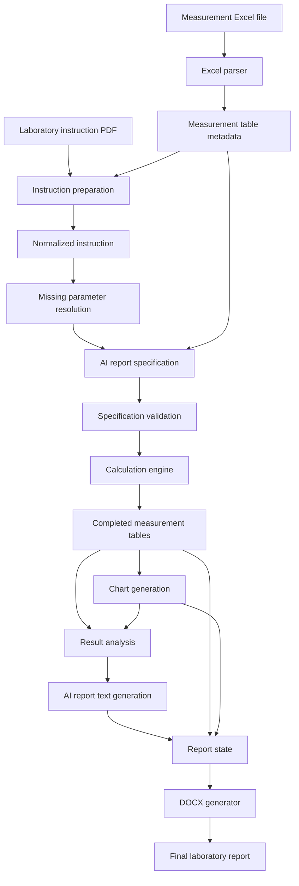

# Lab Report AI

**AI-assisted backend for generating structured laboratory reports from measurement data and laboratory instructions.**

Lab Report AI transforms laboratory measurements and experiment instructions into a structured report workflow containing calculations, charts, data analysis, written conclusions and a final DOCX document.

The project combines deterministic data processing with AI-assisted interpretation while keeping calculations and validation under application control.

> **Current status:** Backend v1.0 completed.  
> Frontend development is the next stage of the project.

---

## Overview

Creating laboratory reports usually requires repeating the same workflow:

1. Read the laboratory instruction.
2. Understand which calculations are required.
3. Process measurement tables.
4. Create charts.
5. Analyze results.
6. Write conclusions.
7. Format everything into a report.

Lab Report AI automates this process while keeping the numerical part deterministic.

The AI is responsible mainly for understanding the laboratory instruction, creating a structured report specification and assisting with result interpretation.

Calculations, data validation, chart generation and report assembly are handled by the backend.

---

## Main Features

### Laboratory instruction processing

The backend can process a laboratory instruction provided as a PDF and combine it with metadata extracted from measurement tables.

It generates a normalized instruction describing:

- required calculations,
- required charts,
- report sections,
- missing experiment parameters.

Missing parameters can then be supplied by the user before report generation.

---

### Multi-table Excel support

Measurement files may contain multiple worksheets and measurement tables.

The backend automatically extracts:

- table identifiers,
- sheet names,
- column names,
- units,
- information about which columns already contain measurements.

Empty but named result columns are preserved so that calculated values can be inserted later.

---

### Deterministic calculation engine

Mathematical operations are executed by the application instead of the language model.

The calculation engine supports:

- variables,
- constants,
- nested expressions,
- dependencies between calculations,
- automatic calculation ordering,
- circular dependency detection,
- protection of existing measurement values.

Calculated columns can depend on results produced by previous calculations.

---

### Automatic chart generation

Charts are generated directly from measurement data.

Supported functionality includes:

- multiple measurement tables,
- multiple series on one physical figure,
- linear and logarithmic scales,
- data filtering,
- automatic column matching,
- configurable grid and legend behavior,
- PNG chart generation.

---

### Result analysis

The backend analyzes calculated measurement data and generated chart relationships.

It can determine information such as:

- minimum and maximum values,
- mean values,
- first and last measurements,
- overall trend direction,
- monotonicity,
- correlation,
- values at the boundaries of a chart.

These deterministic statistics are then available to the report text generation stage.

---

### AI-assisted report text

Structured measurement analysis is provided to the language model together with the laboratory instruction.

The model generates report content based on already calculated and analyzed data rather than performing numerical calculations itself.

This separation reduces the risk of numerical hallucinations.

---

### Report specification validation

AI-generated report specifications are validated before they are accepted.

The validator checks, among other things:

- measurement table references,
- calculation dependencies,
- calculation outputs,
- chart variables,
- section assignments,
- physical figure ownership,
- consistency between Excel columns and report sections.

If the generated specification is invalid, the backend can request a repaired version and validate it again.

---

### DOCX report generation

The final report can be exported as a Microsoft Word document.

Generated reports can contain:

- title page,
- purpose of the experiment,
- theoretical content,
- measurement tables,
- calculations,
- mathematical equations,
- charts,
- experiment setup images,
- analysis,
- conclusions.

---

### Experiment setup images

Users can attach setup diagrams or photographs to a report.

Images can be:

- uploaded,
- assigned to one or more report sections,
- reassigned,
- replaced,
- deleted.

Uploaded images are validated and stored as PNG files.

---

### Profiles and subjects

The backend stores reusable information about:

- student profile,
- university,
- faculty,
- field of study,
- semester,
- group,
- academic year,
- laboratory subjects,
- instructors.

This data is automatically included in report metadata.

---

## Processing Pipeline



---

## Tech Stack

### Backend

- Python
- FastAPI
- Pydantic
- OpenAI API

### Data processing

- pandas
- NumPy
- SymPy
- openpyxl

### Visualization

- Matplotlib

### Document generation

- python-docx
- lxml
- Pillow

### Testing

- pytest
- FastAPI TestClient
- httpx

---

## Project Structure

```text
lab-report-ai/
│
├── api/
│   └── routes/
│       ├── profile.py
│       ├── reports.py
│       └── subjects.py
│
├── app/
│   ├── core/
│   │   └── openai_client.py
│   │
│   ├── schemas/
│   │   └── ...
│   │
│   ├── services/
│   │   ├── calculation_engine.py
│   │   ├── chart_generator.py
│   │   ├── docx_generator.py
│   │   ├── example_calculations.py
│   │   ├── excel_reader.py
│   │   ├── instruction_parameter_resolver.py
│   │   ├── instruction_parser.py
│   │   ├── instruction_preparer.py
│   │   ├── openai_file_service.py
│   │   ├── result_analyzer.py
│   │   ├── specification_validator.py
│   │   ├── storage.py
│   │   └── ...
│   │
│   └── main.py
│
├── tests/
│   └── ...
│
├── .env.example
├── pytest.ini
├── requirements.txt
└── README.md
```

---

## Installation

Clone the repository:

```bash
git clone https://github.com/Nograt/lab-report-ai.git
cd lab-report-ai
```

Create a virtual environment:

```bash
python -m venv .venv
```

Activate it.

### Windows

```powershell
.venv\Scripts\Activate.ps1
```

### Linux / macOS

```bash
source .venv/bin/activate
```

Install dependencies:

```bash
pip install -r requirements.txt
```

---

## Environment Variables

Create a `.env` file based on `.env.example`.

```env
OPENAI_API_KEY=your_openai_api_key
OPENAI_MODEL=your_model_name
```

Never commit the `.env` file or API keys to the repository.

---

## Running the API

Start the development server:

```bash
uvicorn app.main:app --reload
```

The API will be available at:

```text
http://127.0.0.1:8000
```

FastAPI documentation:

```text
http://127.0.0.1:8000/docs
```

Alternative documentation:

```text
http://127.0.0.1:8000/redoc
```

Health check:

```text
GET /health
```

Expected response:

```json
{
  "status": "ok"
}
```

---

## Main API Areas

The backend currently provides APIs for:

### Reports

- laboratory instruction preparation,
- missing parameter resolution,
- report analysis and generation,
- report state retrieval,
- completed measurement data,
- chart configuration,
- example calculations,
- setup images,
- DOCX generation.

### Profile

Student and university information used when generating reports.

### Subjects

Laboratory subject and instructor management.

---

## Testing

The project contains unit and API tests covering the most important parts of the report generation pipeline.

Run the complete test suite with:

```bash
pytest
```

or:

```bash
python -m pytest -q
```

The tests cover areas including:

- calculation execution,
- calculation dependencies,
- Excel parsing,
- report specification validation,
- chart generation,
- result analysis,
- instruction parameter resolution,
- OpenAI integration boundaries using mocks,
- storage,
- FastAPI endpoints,
- report generation workflow.

External OpenAI requests are mocked in automated tests.

---

## Design Principles

### Deterministic calculations

The language model does not directly calculate measurement results.

Mathematical operations are represented as structured expressions and evaluated by the backend.

### AI as an interpreter

AI is primarily used to convert unstructured laboratory instructions into structured application data and to generate natural-language report content.

### Validation before execution

AI output is treated as untrusted structured input and validated before calculations or report generation begin.

### Separation of responsibilities

The project separates:

```text
instruction understanding
        ↓
report specification
        ↓
validation
        ↓
calculations
        ↓
charts
        ↓
analysis
        ↓
report text
        ↓
DOCX generation
```

This makes individual parts of the pipeline easier to test and maintain.

---

## Current Status

### Backend v1.0

The first backend version includes the complete report generation pipeline:

```text
PDF instruction
        +
Excel measurements
        ↓
structured instruction
        ↓
report specification
        ↓
calculations
        ↓
charts
        ↓
analysis
        ↓
report text
        ↓
DOCX report
```

### Next

Frontend application for managing the complete workflow through a graphical interface.

Planned frontend functionality includes:

- profile and subject configuration,
- instruction and Excel upload,
- missing parameter form,
- report generation progress,
- measurement preview,
- chart configuration,
- setup image management,
- report preview,
- DOCX download.

---

## Project Goal

Lab Report AI is intended to explore how AI can be integrated into engineering workflows without delegating deterministic numerical work to a language model.

The project combines:

**AI + backend engineering + data processing + engineering calculations + document generation**

into one end-to-end application.